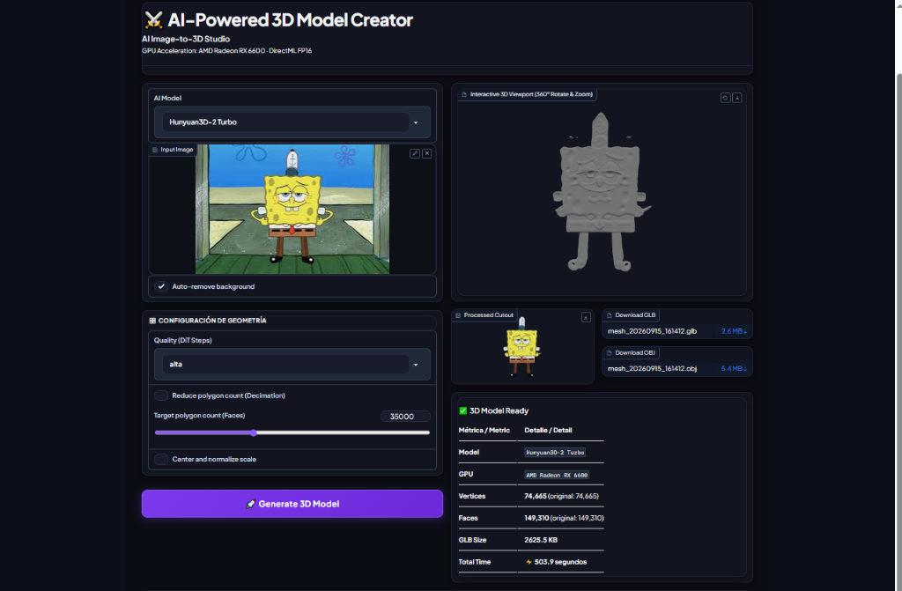

<div align="center">

# AI-powered 3D model creator compatible with (RX 6600, among others) – Open source
### Creador de Modelos 3D impulsado por IA compatible con (RX 6600, entre otras) – Codigo Abierto

[](LICENSE)
[](https://pytorch.org/)
[](https://github.com/microsoft/DirectML)
[](https://www.python.org/)
[](#compatibilidad-de-hardware-verificada)
[](https://gradio.app/)

**Genera mallas 3D profesionales (.glb y .obj) listas para produccion a partir de una sola imagen 2D localmente en tu ordenador.**  
Disenado especificamente para resolver el cuello de botella de 8GB de VRAM, permitiendo ejecutar modelos generativos 3D de miles de millones de parametros en GPUs de gama media como la **AMD Radeon RX 6600**, asi como en NVIDIA GeForce, Intel Arc y CPU.

**Autor y Desarrollador Principal:** **Carlos B (eLdarqO)**

[English (README.md)](README.md) | [Registro Tecnico: Desafios y Soluciones](docs/CHALLENGES_AND_SOLUTIONS.md) | [Como Funciona](docs/HOW_IT_WORKS.md) | [Benchmarks de Hardware](docs/HARDWARE_SPECS.md) | [Arquitectura](docs/ARCHITECTURE.md)

</div>

---

## Vista Previa de la Interfaz

Captura en tiempo real del estudio web ejecutandose en una tarjeta **AMD Radeon RX 6600 (8GB)**, mostrando la eliminacion automatica de fondo y la reconstruccion 3D dentro del visor interactivo:



---

## Por Que Existe Este Proyecto?

Los modelos generativos de ultima generacion para Image-to-3D (como **Hunyuan3D-2 Turbo** de Tencent) combinan modelos de vision gigante (DINOv2 con 1.14B parametros), transformadores de difusion Flow-Matching (DiT con 560M parametros) y decodificadores espaciales de atencion cruzada (328M parametros).

Ejecutar estos modelos tal cual vienen de fabrica requiere mas de **14 GB de VRAM**. En tarjetas graficas comerciales de 8 GB (como la AMD Radeon RX 6600, RX 7600 o RTX 3060/4060 de 8GB), los scripts fallan de inmediato con errores de falta de memoria (OOM), mientras que el modo CPU tarda entre **11 y 15 minutos** por modelo.

Este proyecto introduce **Gestion Secuencial de Memoria**, **Atencion Fragmentada en DINOv2**, **Paso de Integracion Euler sin Copias PCIe** y **Decodificacion VAE con Cache KV**, reduciendo el tiempo de generacion en una AMD RX 6600 de 8GB a solo **~2.0 – 2.5 minutos**, con un consumo pico de VRAM de apenas **~3.2 GB**.

---

## Caracteristicas

- **Motor Multi-Modelo (`app/models/`):**
  - **Hunyuan3D-2 Multi-View Turbo**: Reconstruccion avanzada multi-angulo combinando hasta 4 perspectivas (Frontal 0 deg, Izquierda 90 deg, Trasera 180 deg, Derecha 270 deg) mediante incrustaciones sinusoidales 1D de angulo de camara. Elimina completamente las alucinaciones geometricas en la parte posterior y los laterales.
  - **Hunyuan3D-2 Turbo**: Maxima fidelidad geometrica y detalle superficial (~2.0 - 2.5 min en RX 6600).
  - **TripoSR**: Generacion feed-forward instantanea (~12 segundos) para prototipos veloces.
  - **Base Modular**: Arquitectura `Base3DModel` para conectar facilmente futuros modelos de IA.
- **Aceleracion Nativa AMD RDNA & DirectML:**
  - Pipeline completo en DirectML FP16 para Windows sin requerir Linux, WSL2 ni instalaciones experimentales de ROCm.
- **Eliminacion Automatica de Fondo Multi-Angulo:**
  - Extraccion de figura con `rembg` (U2-Net), centrado automatico y margenes proporcionales para todas las perspectivas cargadas.
- **Reduccion y Optimizacion de Poligonos (PyMeshLab):**
  - Colapso cuadratico de aristas para fijar presupuestos exactos de caras (ej. 10k, 25k, 50k poligonos) para exportar directamente a Roblox Studio, Blender, Unity o Unreal Engine.
- **Estudio Web Moderno (`app/web_ui.py`):**
  - Estetica oscura de estudio profesional.
  - **Pestanas de Flujo Dual**: Alterna facilmente entre Vista Unica (una sola foto) y Multi-Angulos 360 (vistas ortogonales frontal, trasera y laterales).
  - **Visor 3D Interactivo (`gr.Model3D`)**: Rota en 360 grados, haz zoom e inspecciona mallas directamente en el navegador.
  - **Selector Dinamico de Idioma**: Cambia entre **Espanol** e **Ingles** en tiempo real.
  - Descarga directa en un clic de archivos `.glb` y `.obj`.

---

## Presets de Calidad y Tiempos de Generacion

El tiempo de procesamiento esta determinado por la **Resolucion del Octree** en la decodificacion espacial:

| Preset | Resolucion Octree | Puntos 3D Calculados | Tiempo en RX 6600 | Caso de Uso Recomendado |
|---|---|---|---|---|
| **Ultra** | 128 (4 pasos) | 2,146,689 (~2.1M) | **~2.0 minutos** | Recomendado para Roblox, videojuegos y pruebas rapidas. |
| **Rapida** | 128 (5 pasos) | 2,146,689 (~2.1M) | **~2.5 minutos** | Balance optimo entre fidelidad y velocidad. |
| **Media** | 192 (5 pasos) | 7,189,057 (~7.1M) | **~4.5 minutos** | Definicion superior en curvas y curvatura. |
| **Alta** | 256 (5 pasos) | 16,974,593 (~17.0M) | **~8.0 minutos** | Densidad geometrica extrema (150k+ caras) para impresion 3D o renders detallados. |

### Ley de Escala Cubica
El espacio tridimensional escala de forma cubica ($(N)^3$):
$$\frac{(256)^3}{(128)^3} = 2^3 = 8\times \text{ mas puntos espaciales calculados}$$
Seleccionar `alta` calcula 8 veces mas puntos que `rapida`, por lo que toma ~8 minutos y produce mas de 149,000 caras poligonales.

---

## Compatibilidad de Hardware Verificada

| GPU / Plataforma | Arquitectura | Backend de Aceleracion | Tiempo Tipico de Generacion | Estado |
|---|---|---|---|---|
| **AMD Radeon RX 6600 (8GB)** | RDNA 2 (Navi 23) | DirectML FP16 | **~2.0 – 2.5 min** | Banco de Prueba Principal |
| **AMD Radeon RX 6700 / 6800 / 6900** | RDNA 2 | DirectML FP16 | **~1.5 – 2.0 min** | Verificado |
| **AMD Radeon RX 7600 / 7700 / 7800 / 7900** | RDNA 3 | DirectML FP16 | **~1.0 – 1.8 min** | Verificado |
| **NVIDIA GeForce RTX 3060 / 4060 (8GB)** | Ampere / Ada | CUDA / DirectML | **~1.2 – 1.8 min** | Compatible |
| **NVIDIA GeForce RTX 3080 / 4080 / 4090** | Ampere / Ada | CUDA FP16 | **~45s – 1.2 min** | Compatible |
| **Intel Arc A750 / A770 (8GB/16GB)** | Alchemist | DirectML FP16 | **~2.0 – 3.0 min** | Compatible |
| **Solo CPU (x86_64 / Apple Silicon)** | Nucleos CPU | PyTorch CPU FP32 | ~11 – 15 min | Modo Respaldo |

---

## Comparativa de Rendimiento (AMD Radeon RX 6600 8GB)

| Etapa | CPU Original | Primer Intento DirectML | Este Proyecto (MAX GPU) | Aceleracion Total |
|---|---|---|---|---|
| **Codificador DINOv2 (1.1B)** | 150.3s (CPU) | 150.3s (Fallback CPU) | **~30.2s (GPU Fragmentado)** | **5.0x mas rapido** |
| **Difusion DiT (4-5 pasos)** | ~250.0s (CPU) | 137.3s (Sync PCIe) | **~89.8s – 112.5s (Zero-Copy GPU)**| **2.5x mas rapido** |
| **Decodificacion VAE (Puntos 3D)**| 280.3s (CPU) | 44.3s (Lotes 10k) | **~25.1s (Cache KV + Lotes 8k)** | **11.2x mas rapido** |
| **Marching Cubes** | ~10.0s (CPU) | Error de Argumentos | **~4.9s (Corregido)** | **2.0x mas rapido** |
| **TIEMPO TOTAL** | **~11.5 minutos** | **~5.5 minutos** | **~2.0 – 2.5 minutos** | **~5x mas rapido global** |

---

## Guia de Inicio Rapido (Windows)

### Opcion 1: Instalador Automatico (Mas Facil)
1. Clona este repositorio:
   ```bash
   git clone https://github.com/CarlosB456/AI-Powered-3D-Model-Creator.git
   cd AI-Powered-3D-Model-Creator
   ```
2. Haz doble clic en **`INSTALL.bat`** para instalar todas las dependencias automaticamente.
3. Haz doble clic en **`START_WEB_UI.bat`** para abrir el estudio en tu navegador (`http://localhost:7860`).

### Opcion 2: Generacion por Arrastrar y Soltar
Arrastra cualquier archivo `.png` o `.jpg` directamente sobre **`CLI_GENERATE.bat`**. Tu modelo 3D se exportara a la carpeta `output/`.

### Opcion 3: Linea de Comandos (CLI)
```bash
# Generacion Multi-Angulo (Vistas Frontal + Izquierda + Trasera, eliminando puntos ciegos):
python app/cli.py --front frontal.png --left izquierda.png --back trasera.png --model "Hunyuan3D-2 Multi-View Turbo" --calidad rapida --rembg

# Generacion de imagen unica con Hunyuan3D-2 Turbo (~2 min, 35k caras objetivo, auto-rembg)
python app/cli.py mi_imagen.png --model "Hunyuan3D-2 Turbo" --calidad ultra --rembg --decimate 35000

# Generacion ultrarrapida de imagen unica con TripoSR (~12 seg)
python app/cli.py mi_imagen.png --model "TripoSR" --rembg
```

---

## Instalacion Manual

### 1. Requisitos
* Windows 10 / 11 o Linux de 64 bits
* Python 3.10 o 3.11 (se recomienda Python 3.11)
* Git instalado

### 2. Instalar PyTorch con DirectML (para GPUs AMD e Intel)
```bash
pip install torch torchvision --index-url https://download.pytorch.org/whl/cpu
pip install torch-directml
```
*(Para usuarios de NVIDIA: `pip install torch torchvision --index-url https://download.pytorch.org/whl/cu121`)*

### 3. Instalar Dependencias
```bash
pip install -r requirements.txt
```

---

## Estructura del Proyecto

```text
AI-Powered-3D-Model-Creator/
├── app/
│   ├── web_ui.py                 # Estudio Web (Bilingue ES/EN, Flujo Dual Vista Unica/Multi-Angulo, Visor 3D)
│   ├── cli.py                    # Linea de comandos unificada con banderas de perspectiva individual y multi-angulo
│   ├── models/
│   │   ├── base.py               # Interfaz abstracta Base3DModel
│   │   ├── hunyuan3d_model.py    # Adaptador Hunyuan3D-2 Turbo DirectML (vista unica)
│   │   ├── hunyuan3d_mv_model.py # Adaptador Hunyuan3D-2 Multi-View Turbo DirectML (multi-angulo)
│   │   └── triposr_model.py      # Adaptador TripoSR ultrarrapido
│   └── processors/
│       ├── background.py         # Recorte automatico de fondo con rembg
│       └── mesh_optimizer.py     # Reduccion de poligonos con PyMeshLab
├── docs/
│   ├── images/
│   │   └── preview.png           # Captura real de la interfaz del estudio
│   ├── CHALLENGES_AND_SOLUTIONS.md # Bitacora tecnica de los 10 problemas resueltos en RX 6600
│   ├── HOW_IT_WORKS.md           # Explicacion matematica y de arquitectura
│   ├── HARDWARE_SPECS.md         # Banco de pruebas de hardware y consumos de VRAM
│   └── ARCHITECTURE.md           # Diagramas de flujo y ciclo de vida de memoria
├── Hunyuan3D-2/                  # Motor principal con parches DirectML
├── TripoSR/                      # Motor feed-forward
├── output/                       # Modelos .glb y .obj generados
├── START_WEB_UI.bat              # Lanzador web en 1 clic
├── CLI_GENERATE.bat              # Lanzador arrastrar y soltar
├── INSTALL.bat                   # Instalador automatico
├── requirements.txt              # Dependencias fijadas
├── LICENSE                       # Licencia de Codigo Abierto Apache 2.0
├── README.md                     # Documentacion en ingles
└── README_ES.md                  # Documentacion en espanol
```

---

## Autor y Creditos

* **Creador y Desarrollador Principal:** **Carlos B (eLdarqO)**

Agradecimientos especiales a los equipos detras de:
- **Tencent Hunyuan Team** por [Hunyuan3D-2](https://github.com/Tencent/Hunyuan3D-2)
- **Stability AI & Tripo AI** por [TripoSR](https://github.com/VAST-AI-Research/TripoSR)
- **Microsoft DirectML Team** por [torch-directml](https://github.com/microsoft/DirectML)
- **Daniel Gatis** por [rembg](https://github.com/danielgatis/rembg)
- **Visual Computing Lab** por [PyMeshLab](https://github.com/cnr-isti-vclab/PyMeshLab)

---

## Licencia

Distribuido bajo la **Licencia Apache 2.0**. Consulta el archivo [LICENSE](LICENSE) para mas detalles.
