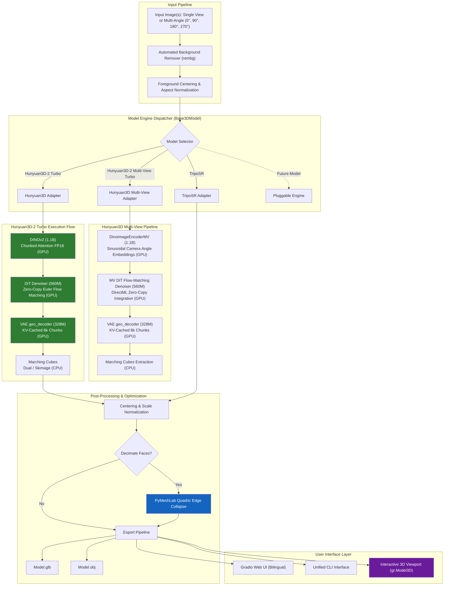

# AI-Powered 3D Model Creator Architecture

AI-Powered 3D Model Creator is structured as a modular, hardware-agnostic 3D generation framework designed to accommodate multiple AI model engines while providing unified pre-processing, post-processing, and interactive presentation.

---

## System Architecture Diagram

---

## Key Architecture Principles

### 1. Unified Model Abstraction (`app/models/base.py`)
All 3D generative backends implement the `Base3DModel` contract:
- `load(device)`: Initializes weight checkpoints and applies necessary kernel patches.
- `generate(image, quality, progress_callback, **kwargs) -> trimesh.Trimesh`: Converts 2D pixel matrices into a watertight 3D triangle mesh.
- `unload()`: Releases host and device buffers cleanly to allow sequential multi-model evaluation without memory accumulation.

### 2. Isolated Pre/Post Processors (`app/processors/`)
- **`background.py`**: Separates foreground silhouettes from cluttered imagery using deep boundary extraction (`u2net` via `rembg`), standardizing inputs across all models.
- **`mesh_optimizer.py`**: Interacts with `PyMeshLab` to execute topologically-aware quadric surface reduction, allowing artists to export game-ready low-poly assets or uncompressed high-poly source meshes.

### 3. Progressive Device Memory Swapping
To execute on budget gaming GPUs (8GB VRAM), memory is scheduled in discrete phases:
1. Load Encoder $\rightarrow$ Execute $\rightarrow$ Offload to Host RAM.
2. Load Denoiser $\rightarrow$ Execute $\rightarrow$ Offload to Host RAM.
3. Load Decoder $\rightarrow$ Execute $\rightarrow$ Offload to Host RAM.
This prevents concurrent residency of incompatible weight tensors while keeping per-generation latency around 2 minutes.
